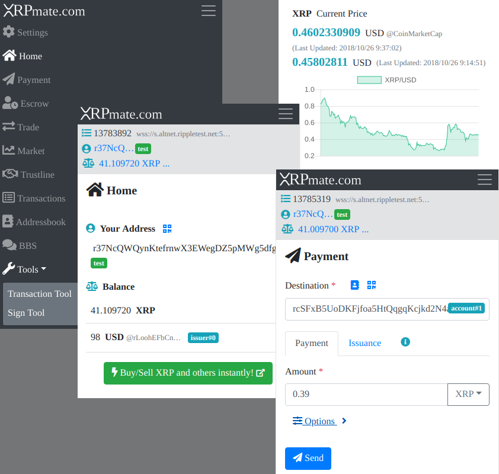
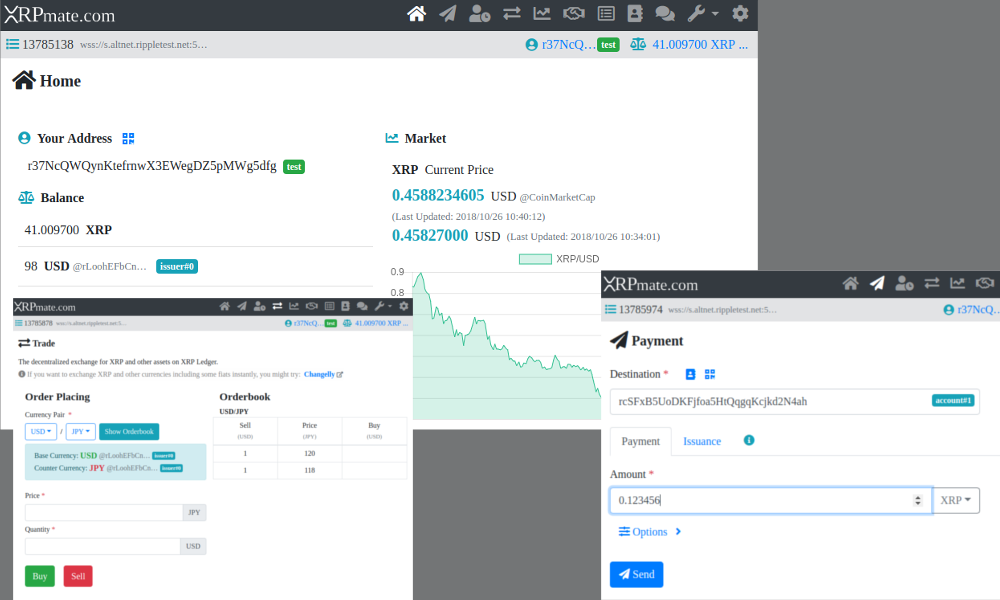

# XRPmate.com : The Next Generation Ripple/XRP Web Wallet

### [XRPmate.com](https://xrpmate.com)

## What is this?

A web wallet for XRP and assets on the XRP Ledger. It's practically a next generation [Ripple Wallet](https://chrome.google.com/webstore/detail/ripple-wallet/pbdihppojjickcoendiloibpjokjaobc), reborn as a mobile-friendly web application. It covers almost all of functions as XRP Ledger wallet. 

## Features

+ Account Generator
+ Payment XRP and assets
+ Transaction Viewer
+ Escrow
+ Exchange
+ XRP Price Chart
+ Addressbook
+ Support and Donation BBS
+ Some convenient tools etc.

## Security

#### Keeps Your Secret Secure

Your secret seed is NEVER sent on the internet and NEVER stored in anywhere on your local disk. All your transaction is signed just inside your device and submitted so that it won't leave your device. So it's secure.

#### SRI Protection

All 3rd party libraries on which this wallet depends are protected by [SRI (Subresource Integrity)](https://developer.mozilla.org/en/docs/Web/Security/Subresource_Integrity). 

#### As a XRP Browser

If you won't submit any transactions, for example use it as a XRP Browser, there is no need to enter your secret seed. So feel free to try its non-transactional features without making up your mind :)

## IMPORTANT NOTE

#### DO NOT TRUST ANY EXTENSIONS!!

**We highly recommend to use browser in [**Incognito Mode**](https://support.google.com/chromebook/answer/95464?co=GENIE.Platform%3DDesktop&hl=en) or on which any extension has not been installed.** The reason why is that your secret seed or any other informations could have been stolen by any malicious extensions. Trust no one, protect your digital assets by yourself.

## FAQ

> Where is my secret seed stored?

It's NEVER stored in anywhere on any disk. Of course, NEVER sent on the internet. So, it's counterparty-risk-free.
In other words, **you need to keep it safe by yourself at your own risk.** 

> Oops, I've forgot my secret seed!

As usual with crypto currencies, it means that **you cannot move your assets on the XRP Ledger again!** That's why you must not forget it. 

> Is it Open-Source?

Actually YES. The reason why *"Actually YES"* is that anytime you want you can verify its code and behaviors by yourself by using some browser's tool (for example, [Chrome DevTools](https://developers.google.com/web/tools/chrome-devtools/)). *"Don't Trust, Verify."*

> Who owns its copyright?

It's owned by its [authors](#authors). We don't intend to let it go so far.

> What is TestNet?

It's a alternative network of XRP Ledger, which is used for development and test. All assets on TestNet are worthless. Generally, almost users won't use it.

## Changelog

### v1.0.0 (2018-10-31)

- The first release.

## Supports and Donations

You may give/take supports and donate XRP on this webapp's `BBS` menu. Your goodwill donations make our day to improve this webapp. Thank you!

## Authors

- Akira TANAKA - [GitHub](https://github.com/akirattii)

