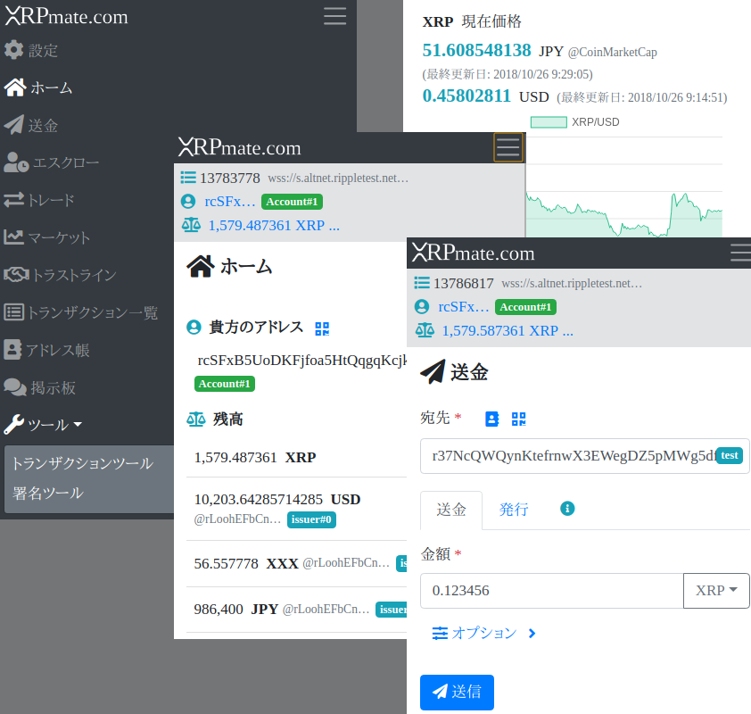

# XRPmate.com : 次世代型 Ripple/XRP Webウォレット

### [XRPmate.com](https://xrpmate.com)

## これはなんですか？

XRPと XRP Ledger 上のアセットを簡単に送金したり取引したりできるモバイルフレンドリーなWebアプリケーションです。
これは[RippleウォレットChrome拡張機能](https://chrome.google.com/webstore/detail/ripple-wallet/pbdihppojjickcoendiloibpjokjaobc)のモバイル対応かつ純粋なWebアプリケーションとして改良された、事実上の次世代バージョンです。XRP Ledger上での基本的な機能をほぼ全て網羅しています。

## 機能

+ アカウントの生成
+ XRPやアセットの送受信
+ トランザクション一覧
+ エスクロー
+ アセット取引所
+ XRP相場チャート
+ アドレス帳
+ サポート掲示板
+ その他の便利ツール

## セキュリティ

#### 秘密種の安全性を重視

貴方の大切な秘密種をネットワーク上に流したりローカルディスクに保存したりすることは**一切ありません**。全てのトランザクションはローカルで署名されてからサブミットされますが、署名の際に使われる秘密種はディスクのどこにも保存されませんし、もちろんどこにも送信されません。

#### SRI で依存ライブラリの改ざん防止

サードパーティ製の依存ライブラリは全て [SRI (Subresource Integrity)](https://developer.mozilla.org/ja/docs/Web/Security/Subresource_Integrity) によって改ざん防止措置が施されています。

#### XRPブラウザとしても

もしトランザクションを実行しないのであれば（たとえばアカウント情報等の閲覧だけであれば）、秘密種の入力は一切必要ありません。ですので、セキュリティリスクが心配な方でもトランザクション不要な全ての機能は気軽に試してみることができます :)

## 重要: 利用上の注意

#### ブラウザ拡張機能にご注意

**当ウォレット利用の際には、[「シークレットモード」](https://support.google.com/chrome/answer/95464?co=GENIE.Platform%3DDesktop&hl=ja)または拡張機能が一切インストールされていない状態のWebブラウザを利用することを強く推奨します。**
理由としては、万が一貴方のブラウザに何らかの悪意の有るブラウザ拡張機能がインストールされていた場合、貴方が入力した秘密種等の情報が抜かれてしまう危険性があるからです。貴方の大切なデジタル資産を危険に晒さないためにも、信頼できない拡張機能は一切インストールされないことをお勧めします。

## FAQ

> 私の秘密種はどこに保存されますか？

貴方の秘密種は貴方のディスクのどこにも保存されません。もちろん、ネットワークを流れることもありません。ですから、大切な秘密種は決して忘れないよう貴方自身の責任で大切に保管してください。

> 秘密種を忘れてしまった！

他の全ての暗号通貨がそうであるように XRP Ledger においてもまた、秘密種を忘れてしまうと送金などはほぼ不可能となります。それを予防するため、最初に秘密種を生成した時はどこか安全な場所に、例えば紙媒体やスクリーンショット画像などで、大切に保管しておくことを推奨します。

> オープンソースですか？

はい。GitHubなどには現時点ではコードを公開していませんが、**事実上のオープンソース**です。なぜ「事実上の」かというと、ユーザはChrome内蔵のDevToolを使っていつでもソースコードを確認することができるだけでなく、ネットワーク・アクセスさえもユーザ自身で確認することができるからです。このWebアプリを盲目的に信じる必要はありません。貴方自身の目で検証してみてください。

> 著作権はどうなっていますか？

著作権については開発者にあります。著作権は放棄しておりません。

> テストネットって？

テストネット上のXRPやアセットは無価値です。テストネットは主に開発者によるテスト目的で使われます。基本的には、一般ユーザがテストネットモードを使うことはないでしょう。

## 変更履歴

### v1.0.0 (2018-10-31)

- 最初のリリース。

## 寄付とサポート

サポートを受けたい方や寄付をしたい方は、当アプリケーションの「掲示板」メニューからご投稿いただけます。
皆様のご協力が機能改善や今後のバージョンアップの励みになります。ご協力に感謝いたします！

## 開発者

- Akira TANAKA - [GitHub](https://github.com/akirattii)
